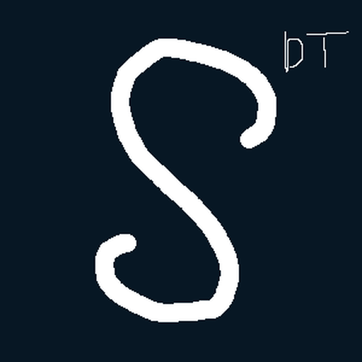

<p align="center">
  <a href="https://stakedevtool.com">
    
  </a>
</p>

<h1 align="center">Stake Dev Tool</h1>

<p align="center">
  The open-source workbench and cloud platform for slot games on the
  <a href="https://stake-engine.com/">Stake Engine</a> RGS contract.
</p>

<p align="center">
  <a href="https://github.com/Stake-Dev-Tool/stake-dev-tool/releases/latest">
    
  </a>
  <a href="https://github.com/Stake-Dev-Tool/stake-dev-tool/releases">
    
  </a>
  <a href="https://github.com/Stake-Dev-Tool/stake-dev-tool/actions/workflows/ci.yml">
    
  </a>
  <a href="LICENSE">
    
  </a>
</p>

<p align="center">
  <a href="https://stakedevtool.com"><b>Website</b></a> ·
  <a href="https://app.stakedevtool.com"><b>Cloud</b></a> ·
  <a href="https://github.com/Stake-Dev-Tool/stake-dev-tool/releases/latest"><b>Download</b></a> ·
  <a href="docs/getting-started.md"><b>Docs</b></a> ·
  <a href="CONTRIBUTING.md"><b>Contributing</b></a>
</p>

---

Building a slot for Stake Engine means iterating against an RGS all day:
spin, inspect the event stream, tweak the front, force that one rare
outcome, show it to QA. Stake Dev Tool makes that loop instant — locally on
your machine, in the browser for your team, and through real playable links
for everyone else.

**One Rust engine, three surfaces:**

1. **Desktop app** — the local dev loop: front hot-reload, local math,
   instant restarts. Free and MIT forever.
2. **Web workbench** — the same workbench served from the cloud. Math devs,
   QA and PMs get it in a browser with zero install.
3. **Share links** — every link is a real hosted game instance on its own
   `<slug>.play.` subdomain, playing against a real server-side RGS. Your
   math files never leave the server.

The entire platform is open source and fully self-hostable with every
feature included. The optional subscription at
[stakedevtool.com](https://stakedevtool.com/pricing) sells hosting on our
infrastructure — nothing else.

## Highlights

- **Drop-in RGS** — a fast Rust server speaking the Stake Engine wallet
  contract, straight from your simulation output (`index.json`, lookup
  tables, zstd books).
- **Multi-resolution test view** — run your game side-by-side at 7 built-in
  resolutions plus custom sizes, each frame its own session, with a live
  SSE event stream and bet history.
- **Force, replay, bookmark** — pin any `(mode, eventId)`, replay a saved
  outcome, bookmark notable rounds (auto-picked min / avg / max per mode).
- **Math revisions** — immutable snapshots with content-addressed dedup and
  an automatic changelog per push (RTP per mode, max win, modes changed).
- **`sdt` CLI for CI** — math comes from simulations, so the real workflow
  is CI pushing a revision: `sdt push ./math/my-game`.
- **Team sync** — profiles, saved rounds and bookmarks flow through the
  workspace live; replays reference `(revision, mode, eventId)`, so a math
  push never breaks a bookmark.
- **Zero-friction HTTPS** — a bundled local CA on desktop, wildcard TLS in
  the cloud. No browser warnings, no game-code hacks.

## Quick start

**Cloud (zero install).** Create an account at
[app.stakedevtool.com](https://app.stakedevtool.com) and invite your team.

**Desktop.** Download the latest build for Windows, macOS (Apple Silicon)
or Linux from the [Releases page](https://github.com/Stake-Dev-Tool/stake-dev-tool/releases/latest),
then follow the [getting started guide](docs/getting-started.md).

**Self-host.** One Linux box, Docker, Postgres and Caddy — the same stack
we run in production:

```bash
git clone https://github.com/Stake-Dev-Tool/stake-dev-tool.git && cd stake-dev-tool/deploy
cp .env.prod.example .env.prod && $EDITOR .env.prod
docker compose -f docker-compose.prod.yml --env-file .env.prod up -d --build
```

Full walkthrough (DNS, TLS, backups, updates) in
[`deploy/README.md`](deploy/README.md).

## Documentation

| Guide | What's inside |
| --- | --- |
| [Getting started](docs/getting-started.md) | Install, first run, math folder layout, macOS notes |
| [Architecture & HTTP API](docs/architecture.md) | How it fits together, RGS endpoints, standalone LGS |
| [Self-hosting](deploy/README.md) | Production deploy: DNS, TLS, backups, updates |
| [`sdt` CLI](crates/cli/README.md) | Push math revisions from CI |
| [Server development](crates/server/README.md) | Cloud server config, local dev, integration tests |
| [V2 design doc](V2.md) | Architecture decisions and roadmap |
| [Changelog](CHANGELOG.md) | What changed in each release |

## Contributing

Bug reports, feature ideas and pull requests are all welcome — start with
[CONTRIBUTING.md](CONTRIBUTING.md) for the dev setup, project layout and PR
process. Found a security issue? See [SECURITY.md](SECURITY.md) instead.

## License

One repository, three licensing zones:

| Path | License |
| --- | --- |
| Everything not listed below — desktop app, `lgs` engine, CLI, protocol, test-view UI, deploy configs | **MIT** — [LICENSE](LICENSE) |
| `crates/server/`, `web/` (the cloud server + its dashboard) | **AGPL-3.0** — [crates/server/LICENSE](crates/server/LICENSE) |
| [Stake-Dev-Tool/site](https://github.com/Stake-Dev-Tool/site) (the stakedevtool.com marketing site, separate repo) | Source-visible, **all rights reserved** |

Self-hosting the server is free forever and untouched by the AGPL — the
licence only requires anyone offering a modified server as a hosted service
to publish their changes.

---

<p align="center">
  <sub>
    Built by <a href="https://github.com/simnJS">@simnJS</a> and
    <a href="https://github.com/Malasuerte94">@Malasuerte94</a> ·
    <a href="https://stakedevtool.com">stakedevtool.com</a> ·
    <a href="https://github.com/Stake-Dev-Tool/stake-dev-tool/issues/new/choose">Report a bug</a>
  </sub>
</p>
